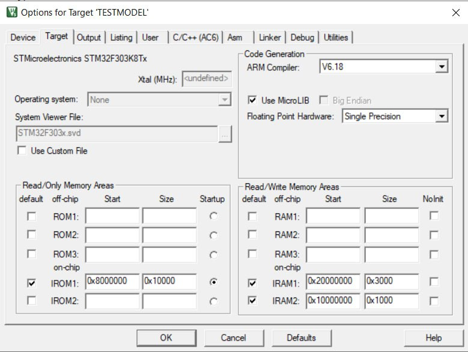
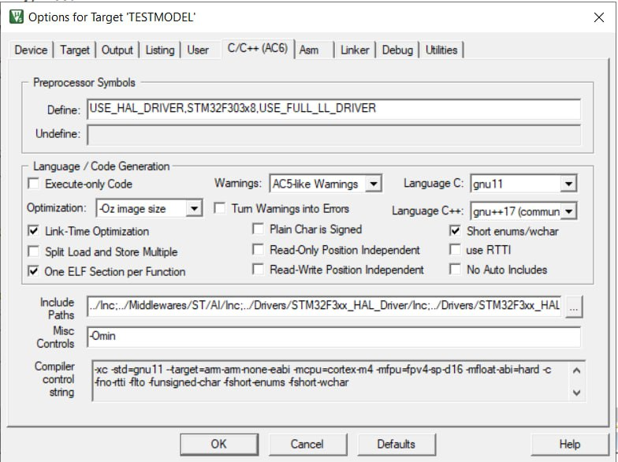

# Training
### Environment setup
Go into the `Training` directory.  
Create an python environment and install the requirements file.

### Training
simply run:  
`python training/train.py`  
(Please note that we are still in the `Training` directory, a subdirectory is called `training` )  
A new folder `saved_models` is created where the model files are stored.  
You need to select your optimal model.

### Weight export
Open the notebook `netron_tens/nunpy_to_c_QAT.ipynb`  
You need to select the model in the first cell, then simply run the whole notebook and a new file `wights_Quant.hpp` is created. This file needs to be copied into the c Project.

# Compile C Project+
Inside `CProject` open `TESTMODEL` in MDK5  
Inside MDK5 project the following options need to be set:
* **Arm Compiler Version 6.18** (essential)
* c compiler flags `-Omin`
* Activate Link Time Optimization
* Use Oz
* Language C: gnu11
* Language C++: gnu++17 (community)

Please double check these settings with the following images:

